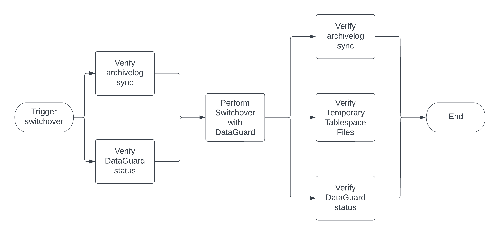

# Oracle DataGuard operations roles

This project contains roles related to performing a switchover of an Oracle database that is controlled using DataGuard. The process basically looks like this:

As the diagram shows, the pre-switchover checks are replicated after the switchover is performed (and an additional check, for temporary tablespace files, is added). If any of the steps fails, the process stops with a message to consult with the DBA team.

These process steps are covered by four roles. These would ordinarily form part of a larger workflow in Ansible Automation Platform.

- `oracle_sync_status`: Checks the Oracle archivelog sync status
- `oracle_dataguard_validate`: Checks that DataGuard is happy with the state of the system
- `oracle_dataguard_switchover`: Performs the switchover
- `oracle_check_tempfiles`: Checks that the database has the correct temporary tablespace files

Each role has its own README, in more-or-less standard Galaxy format, with usage information. Please refer there for more information on usage of each.

## Note
There is a lot of room for improvement but hopefully these will give some idea of how to perform switchover operations, and healthcheck operations, with Oracle DataGuard. Writing a module (or modules) would be even better.

